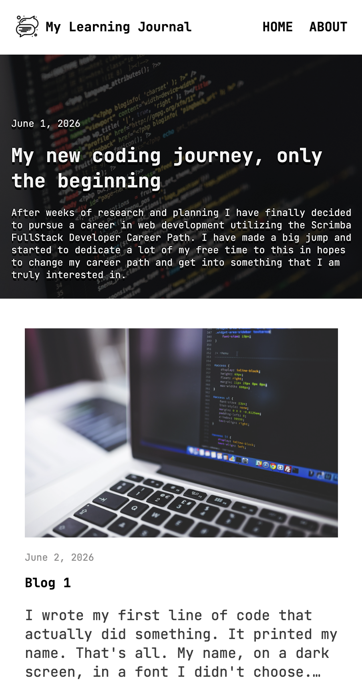
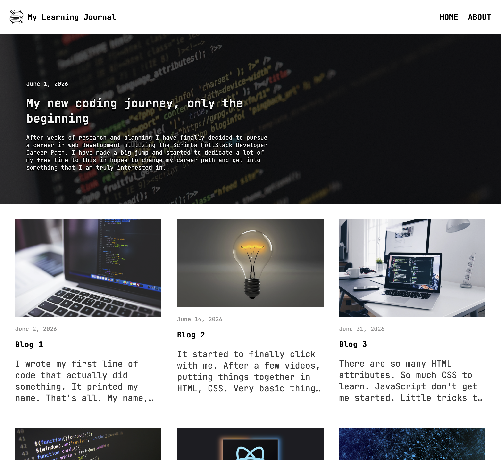

# Victor's Learning Journal

A responsive personal blog documenting a coding bootcamp journey — built with vanilla HTML and CSS, mobile-first. No frameworks, no build step.

     
    

---

## Features

- Three-page site — Home, About Me, and a single blog post template — sharing a consistent header, nav, and footer
- Home page hero image with date, title, and intro text overlaid directly on the photo
- Recent Posts cards reused across all three pages, each linking through to the full post view
- Long post excerpts are automatically truncated with CSS line-clamping instead of overflowing their cards
- Circular profile photo and bio on the About page that reflow from a stacked mobile layout to a side-by-side desktop layout
- Fully responsive from mobile width up, built mobile-first with a single desktop breakpoint
- Custom Google Font (JetBrains Mono) for a consistent, code-forward look

---

## Built With

- **HTML5** — Semantic structure shared across three pages (`index.html`, `about.html`, `post.html`)
- **CSS3** — Flexbox & CSS Grid layout, mobile-first media query, absolute positioning for image text overlays, line-clamping
- **Google Fonts** — JetBrains Mono

---

## Skills Showcased

- Mobile-first responsive design
- CSS Flexbox & Grid layout
- The CSS box model and how padding/margin interact with `width: 100%`
- CSS cascade & specificity, including source order vs. media queries
- Positioning (`relative`/`absolute`) for image text overlays
- Reusable component/class patterns shared across multiple pages
- Debugging layout and responsive bugs (grid items breaking out of flow, horizontal overflow, flex auto-margins)

---
